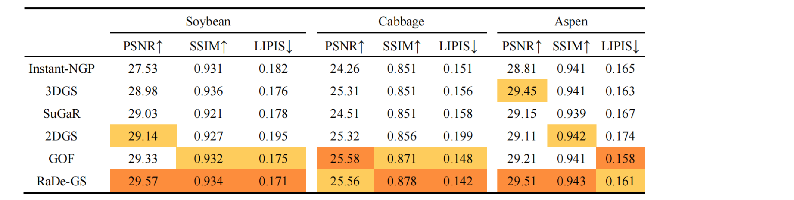

# Benchmarking NeRF and 3D Gaussian Splatting Methods in Plant Phenotyping  


This repo contains the official implementation for the paper "Benchmarking NeRF and 3D Gaussian Splatting Methods in Plant Phenotyping ". Our work compares the application effects of MVS-based, NeRF-based, and Gaussian-based 3D reconstruction technologies on plant phenotyping. Furthermore, we have integrated multiple algorithms into a large-scale project, enabling convenient experimentation with different algorithms simply by modifying the configuration files. In addition, we have provided datasets of soybeans and poplars (COLMAP dataset) and welcome everyone to use them.


## Result
We conducted a systematic evaluation of mainstream 3D reconstruction algorithms based on Neural Radiance Fields (NeRF) and 3D Gaussian Splatting (3DGS) across three plant species: soybean,cabbage and poplar (Populus spp.). The quantitative assessment employed three established metrics: PSNR,SSIM and LPIPS.

We further investigated the effects of image resolution and dataset size (number of input images) on 3D reconstruction quality, conducting controlled parameter analyses across both NeRF and 3DGS frameworks.


## Installation

```bash
# download
git clone https://github.com/Jinlab-AiPhenomics/Plant3DRStudio --recursive

# if you have an environment used for 3dgs, use it
# if not, create a new environment
conda env create --file environment.yml
conda activate surfel_splatting
```

## Training


```bash
python train.py -s <path to COLMAP or NeRF Synthetic dataset>
```


## Testing

```
python render.py -m <path to pre-trained model> -s <path to COLMAP dataset> 
```


## Evaluating

```bash
python scripts/mipnerf_eval.py -m60 <path to the MipNeRF360 dataset>
```

## Acknowledgements

This project is built upon [3DGS](https://github.com/graphdeco-inria/gaussian-splatting). The TSDF fusion for extracting mesh is based on [Open3D](https://github.com/isl-org/Open3D). The rendering script for MipNeRF360 is adopted from [Multinerf](https://github.com/google-research/multinerf/), while the evaluation scripts for DTU and Tanks and Temples dataset are taken from [DTUeval-python](https://github.com/jzhangbs/DTUeval-python) and [TanksAndTemples](https://github.com/isl-org/TanksAndTemples/tree/master/python_toolbox/evaluation), respectively. We thank all the authors for their great repos. 

